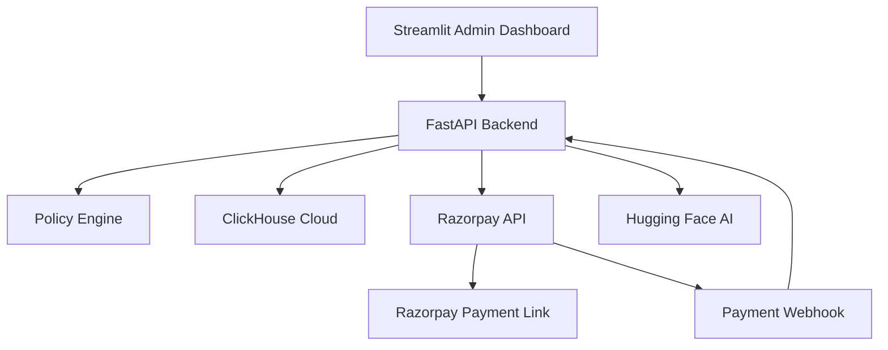

# StudioPay

### AI Finance Controller for Intelligent Revenue Recovery

**Team Members: Samridhi and Puja**  
**Track: AI Finance Controller**  
**Event: Razorpay Buildathon**

> *"A failed payment is not always lost revenue; sometimes, it is revenue waiting for the right next action."*

[](https://www.python.org/)
[](https://fastapi.tiangolo.com/)
[](https://streamlit.io/)
[](https://clickhouse.com/)
[](https://razorpay.com/)
[](https://huggingface.co/)

## Live Application

- **Admin dashboard:** [StudioPay Dashboard](https://studiopay-dashboards.streamlit.app)
- **Backend API:** [StudioPay API](https://studiopay-api.onrender.com)
- **API documentation:** [Swagger UI](https://studiopay-api.onrender.com/docs)

> The Razorpay integration currently operates in **Test Mode**. No real payment is processed during the demonstration.

## The Problem

Businesses lose recoverable revenue when payments fail because of expired cards, temporary gateway errors, UPI timeouts, insufficient funds or bank declines.

Finance teams usually have to inspect every failure manually, select a recovery method, contact the customer, schedule retries and verify the final payment. This is slow and difficult to scale. A single recovery strategy is also ineffective because different failures require different actions.

## Our Solution

StudioPay acts as an **AI Finance Controller** for failed payments. It evaluates the failure reason, payment amount, previous attempts and business policies, then recommends the most appropriate next action:

- Generate a Razorpay Payment Link when another payment method is required.
- Schedule a smart retry for temporary gateway or UPI failures.
- Request human approval for sensitive or high-value payments.
- Stop further recovery after the maximum number of attempts.

StudioPay combines recovery automation with policy-based controls, allowing routine cases to move quickly while keeping important financial decisions under human supervision.

## Key Features

### Revenue Command Center

- Revenue at risk
- Recovered revenue
- Recovery rate
- Active recoveries
- Payment-status distribution
- Automatic actions and approval workload

### Payment Overview

- Search by invoice, vendor or customer
- Filter payments by status
- View customer, contact, amount and currency details
- Track failure reasons, attempt counts and payment dates

### Intelligent Recovery Center

- Policy-based recovery recommendations
- Razorpay Payment Link generation
- Customer email and phone integration
- Email and SMS notification requests
- Smart-retry scheduling
- Existing-link detection and safe reuse

### Manual Approval Workflow

- Routes high-value transactions for human review
- Displays payment and policy information
- Supports approval or rejection by an authorized reviewer
- Prevents sensitive recovery actions from running automatically

### Razorpay Payment Confirmation

- Processes Razorpay webhook events
- Verifies the Payment Link ID and payment ID
- Validates payment amount and currency
- Confirms that the Razorpay payment was captured
- Prevents duplicate webhook processing
- Updates the effective payment status after recovery

### AI Recovery Assistant

The AI assistant lets finance teams ask questions such as:

- Which payments require manual approval?
- Which failed payments can be recovered automatically?
- Why was a smart retry recommended?
- How much revenue is currently at risk?

The assistant uses current ClickHouse payment data to explain recommendations. Financial actions remain controlled by deterministic policies rather than being executed directly by the language model.

### Recovery History

StudioPay records important recovery decisions and outcomes so administrators can understand how a payment moved from failure to recovery.

## Recovery Decision Examples

| Failure condition | StudioPay action | Reason |
|---|---|---|
| Expired card | Send Payment Link | Customer needs another payment method |
| Temporary gateway or UPI error | Smart retry | Payment may succeed after a delay |
| High-value bank decline | Manual review | Human approval is required |
| Maximum attempts reached | Stop recovery | Prevent unnecessary repeated attempts |

## Architecture



## Technology Stack

| Layer | Technology |
|---|---|
| Admin interface | Streamlit |
| Backend API | FastAPI, Python |
| Database and analytics | ClickHouse Cloud |
| Payment recovery | Razorpay Payment Links and Webhooks |
| AI assistant | Hugging Face, Qwen/Qwen3-8B |
| Backend deployment | Render |
| Frontend deployment | Streamlit Community Cloud |

## Project Structure

```text
StudioPay/
├── backend/
│   ├── app/
│   │   ├── agent/             # AI and external tool integration
│   │   ├── api/               # FastAPI routes
│   │   ├── core/              # Application configuration
│   │   ├── db/                # ClickHouse connection
│   │   ├── services/          # Business and recovery logic
│   │   └── main.py            # FastAPI entry point
│   ├── scripts/               # Database and utility scripts
│   └── requirements.txt
├── frontend/
│   └── app.py                 # Streamlit admin dashboard
├── .env.example
├── .gitignore
└── README.md
```

## Local Setup

### 1. Clone the repository

```bash
git clone https://github.com/YOUR_USERNAME/StudioPay.git
cd StudioPay
```

### 2. Create a virtual environment

#### Windows PowerShell

```powershell
python -m venv .venv
.\.venv\Scripts\Activate.ps1
```

#### macOS or Linux

```bash
python -m venv .venv
source .venv/bin/activate
```

### 3. Install dependencies

```bash
pip install -r backend/requirements.txt
```

### 4. Configure environment variables

Create `backend/.env` and add:

```env
APP_ENV=development
FRONTEND_URL=http://localhost:8501
BACKEND_URL=http://localhost:8000

CLICKHOUSE_HOST=
CLICKHOUSE_PORT=8443
CLICKHOUSE_USER=default
CLICKHOUSE_PASSWORD=
CLICKHOUSE_DATABASE=studiopay
CLICKHOUSE_SECURE=true
CLICKHOUSE_VERIFY=true

AGENT_PROVIDER=huggingface
HF_TOKEN=
HF_MODEL=Qwen/Qwen3-8B
HF_PROVIDER=auto

RAZORPAY_KEY_ID=
RAZORPAY_KEY_SECRET=
RAZORPAY_WEBHOOK_SECRET=
```

Never commit `.env`, Streamlit secrets or API credentials to GitHub.

### 5. Prepare ClickHouse

Create the required ClickHouse tables using the SQL file in `backend/scripts/`. Make sure all schema migrations, including `customer_phone` and `next_retry_at`, have been applied to the same database configured in `.env`.

### 6. Run the backend

```bash
cd backend
python -m uvicorn app.main:app --reload --port 8000
```

Backend health check:

```text
http://localhost:8000/api/health
```

Swagger documentation:

```text
http://localhost:8000/docs
```

### 7. Run the admin dashboard

From the project root, open another terminal:

```bash
streamlit run frontend/app.py
```

The dashboard will normally open at:

```text
http://localhost:8501
```

## Main API Endpoints

| Method | Endpoint | Purpose |
|---|---|---|
| `GET` | `/api/health` | Check backend health |
| `GET` | `/api/integrations/status` | Check integration configuration |
| `GET` | `/api/dashboard/summary` | Load dashboard metrics |
| `GET` | `/api/dashboard/payments` | Load recent payments |
| `GET` | `/api/policy/recommendations` | Get recovery recommendations |
| `POST` | `/api/payments` | Add a payment record |
| `POST` | `/api/payments/{payment_id}/payment-link` | Generate a Razorpay Payment Link |
| `POST` | `/api/payments/{payment_id}/smart-retry` | Schedule a smart retry |
| `POST` | `/api/payments/{payment_id}/manual-review` | Submit a manual decision |
| `POST` | `/api/agent/chat` | Ask the AI Recovery Assistant |
| `POST` | `/api/webhooks/razorpay` | Receive Razorpay payment events |

## Razorpay Webhook

For the deployed backend, configure the Razorpay webhook URL as:

```text
https://studiopay-api.onrender.com/api/webhooks/razorpay
```

Store the corresponding webhook secret only in the backend environment variables.

## Challenges We Solved

- Resolved ClickHouse UUID and String comparison errors.
- Migrated existing tables when new columns were introduced.
- Prevented customer phone details from being dropped during ingestion.
- Normalized currency values before sending them to Razorpay.
- Avoided reusing payment links with outdated notification settings.
- Verified Razorpay payment details before marking an invoice as recovered.
- Prevented duplicate webhook events from creating duplicate recoveries.
- Fixed AI SDK compatibility issues during cloud deployment.
- Reduced Streamlit loading time using caching and organized navigation.

## Security Notes

- API keys and passwords must remain in environment variables.
- `.env`, `.venv` and `.streamlit/secrets.toml` must never be committed.
- Payment identifiers, amounts and currencies are validated before recovery.
- High-value actions require human approval.
- Demo payments use Razorpay Test Mode.

## Future Scope

- Background workers for automatic scheduled retries
- Role-based access control for finance teams
- OTP-based customer payment-status access
- Advanced recovery analytics and forecasting
- Multiple notification providers
- Configurable recovery policies for different businesses

## Team

**Samridhi** — Development, payment integration and deployment  
**Puja** — Development, AI workflow and dashboard experience

Built for the **Razorpay Buildathon — AI Finance Controller Track**.
